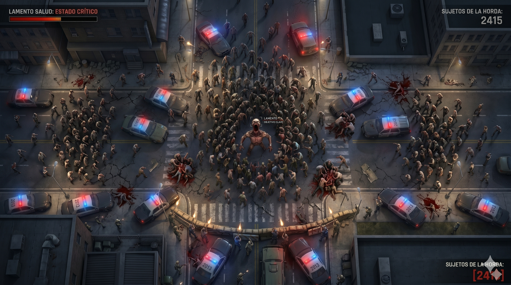

# 1. Mockups

-   Pantalla de inicio: Posee las opciones iniciales que aparecen al abrir el juego.
    
    
-   Selector de personaje: Interfaz para elegir el tipo de líder antes de comenzar.
    

-   Imagen referencial del juego: Representación visual del entorno urbano y la horda.
    
    
-   Pantalla de Game Over: Resumen de estadísticas finales del jugador.
    

# 2. Especificaciones de Tecnología

### **Framework y Justificación**

-   **Base: Vue.js** 
El equipo técnico cuenta con experiencia previa en el ecosistema de Vue. Esto reduce el riesgo de retrasos en el aprendizaje y permite centrar los esfuerzos en las mecánicas del juego. Este framework se utilizará para manejar las estadísticas del juego (salud, tamaño de horda, bonificadores) mediante un estado reactivo.
        
-   **Motor de Juego: Phaser**
Se elige Phaser por ser el más conocido en la creación de juegos HTML. Su amplia base de usuarios y documentación extensa garantizan que el equipo pueda resolver bloqueos técnicos mediante soluciones ya probadas y optimizadas por la comunidad. Se utilizará para realizar el motor del juego, es decir, movimientos, gestión de hordas, acciones de las entidades, sonido, etc.

### **Dependencias Principales**

-   **pnpm**: Gestor de paquetes obligatorio para garantizar la consistencia de dependencias.
    
-   **Vitest**: Para la implementación de las pruebas unitarias requeridas por la evaluación.
    
-   **Docker**: Para la contenerización de la aplicación web.
    

**Estructura de carpetas**
```
/
├── .github/workflows/main.yml  # CI/CD: Tests y DockerHub 
├── src/
│   ├── assets/                # Sprites, sonidos y mapas 
│   ├── components/            # Componentes Vue 
│   ├── game/                  # Lógica de Phaser 
│   └── tests/                 # Pruebas unitarias 
├── Dockerfile                 # Contenerización 
├── pnpm-lock.yaml             # Lockfile de pnpm 
└── README.md                  # Instrucciones y documentación 

```

# 3. Descripción del juego

**HorrorZ** es un juego de supervivencia y acción en 2D con vista top-down. El jugador asume el rol de un zombie en un entorno urbano, cuyo objetivo es propagar la infección convirtiendo civiles y resistiendo el contraataque de las fuerzas del orden el mayor tiempo posible.

**Mecánicas Principales**

-   **Movimiento Perpetuo**: El zombi líder está en constante movimiento. El jugador no puede quedarse quieto, lo que obliga a una navegación activa por las calles de la ciudad.
- **Salud del personaje**: Tienes una salud limitada según el personaje que aumenta a medida que crece la horda de zombies. 
-   **Conversión de Horda**: Al entrar en contacto con civiles, estos se transforman y se unen a la horda que sigue al líder.
    
-   **Escalado de Estadísticas**: A medida que la horda crece, aumentan el rango de conversión, la vida y la resistencia del zombi principal.
    
-   **Interacción con el Entorno**: Los civiles pueden huir y esconderse dentro de las casas para evitar ser infectados. Mientras que los policías y militares tratan de detenerte.
    

**Reglas**

-   **Condición de Victoria**: El objetivo es sobrevivir la mayor cantidad de tiempo posible frente a dificultades progresivas.
  
-   **Umbrales de Ataque**: Para eliminar unidades enemigas, se requiere una cantidad mínima de zombis en la horda.

- **Derrota**: Pierdes una vez que tu barra de salud se acaba.
    

**Flujo del Juego**

-   **Menú Principal**: Acceso a inicio, estadísticas, como se juega y configuración.
    
-   **Gameplay**: Fase activa de infección y supervivencia en el mapa urbano.
    
-   **Game Over**: Pantalla de estadísticas finales basada en el tiempo sobrevivido y tamaño de la horda.